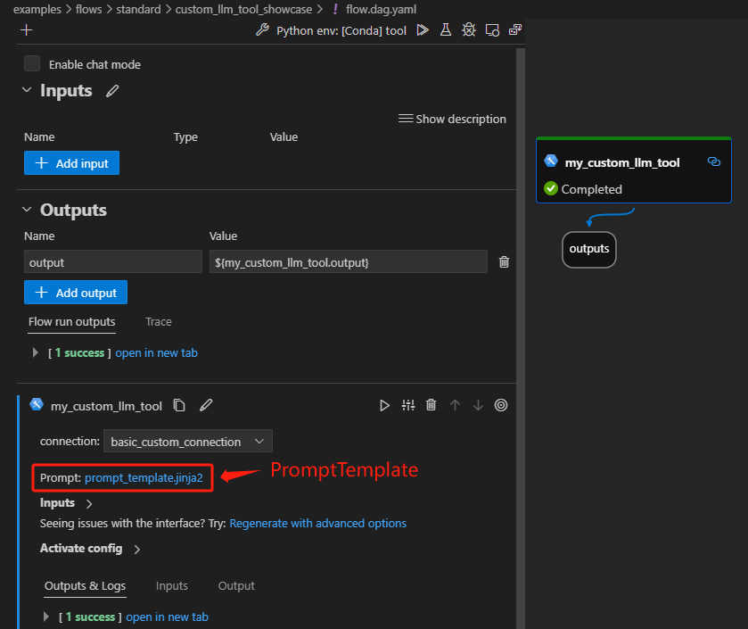

# Create Custom LLM Tool
In this document, we will guide you through the process of developing a tool with `custom_llm` type which can connect to a customized large language model with prompt.

Custom LLM is a large language model fine-tuned by yourself. If you find it has good performance and is useful, then you can follow this guidance to make it a tool so that it can be shared with other people to have more impact.

## Prerequisites
- Please ensure that your [Prompt flow for VS Code](https://marketplace.visualstudio.com/items?itemName=prompt-flow.prompt-flow) is updated to version 1.2.0 or later.

## How to create a custom LLM tool
Here we use [an existing tool package](https://github.com/microsoft/promptflow/tree/main/examples/tools/tool-package-quickstart/my_tool_package) as an example. If you want to create your own tool, please refer to [create and use tool package](create-and-use-tool-package.md).  

1. Develop tool code like in [this example](https://github.com/microsoft/promptflow/blob/main/examples/tools/tool-package-quickstart/my_tool_package/tools/tool_with_custom_llm_type.py).
- Add a `CustomConnection` input to the tool, it is used for authenticating and establishing a connection to the customized large language model.
- Add a `PromptTemplate` input to the tool, it is used to pass into the customized large language model as an argument.

    ```python
    from jinja2 import Template
    from promptflow import tool
    from promptflow.connections import CustomConnection
    from promptflow.contracts.types import PromptTemplate


    @tool
    def my_tool(connection: CustomConnection, prompt: PromptTemplate, **kwargs) -> str:
        # Customize your own code to use the connection and prompt here.
        rendered_prompt = Template(prompt, trim_blocks=True, keep_trailing_newline=True).render(**kwargs)
        return rendered_prompt
    ```

2. Generate the custom LLM tool YAML.  
    Run the command below in your tool project directory to automatically generate your tool YAML, use _-t "custom_llm"_ or _--tool-type "custom_llm"_ to indicate this is a custom LLM tool:  
    ```
    python <path-to-scripts>\tool\generate_package_tool_meta.py -m <tool_module> -o <tool_yaml_path> -t "custom_llm"
    ```
    Here we use [an existing tool](https://github.com/microsoft/promptflow/blob/main/examples/tools/tool-package-quickstart/my_tool_package/yamls/tool_with_custom_llm_type.yaml) as an example.
    ```
    cd D:\proj\github\promptflow\examples\tools\tool-package-quickstart

    python D:\proj\github\promptflow\scripts\tool\generate_package_tool_meta.py -m my_tool_package.tools.tool_with_custom_llm_type -o my_tool_package\yamls\tool_with_custom_llm_type.yaml -n "My Custom LLM Tool" -d "This is a tool to demonstrate the custom_llm tool type" -t "custom_llm"
    ```
    This command will generate a YAML file as follows:

    ```yaml
    my_tool_package.tools.tool_with_custom_llm_type.my_tool:
    name: My Custom LLM Tool
    description: This is a tool to demonstrate the custom_llm tool type 
    # The type is custom_llm.
    type: custom_llm
    module: my_tool_package.tools.tool_with_custom_llm_type
    function: my_tool
    inputs:
        connection:
        type:
            - CustomConnection
    ```

## Use custom LLM tool in VS Code extension
Follow the steps to [build and install your tool package](create-and-use-tool-package.md#build-and-share-the-tool-package) and [use your tool from VS Code extension](create-and-use-tool-package.md#use-your-tool-from-vscode-extension).  

Here we use an existing flow to demonstrate the experience, open [this flow](https://github.com/microsoft/promptflow/blob/main/examples/tools/use-cases/custom_llm_tool_showcase/flow.dag.yaml) in VS Code extension.  
- There is a node named "my_custom_llm_tool" with a prompt template file. You can either use an existing file or create a new one as the prompt template file.  

